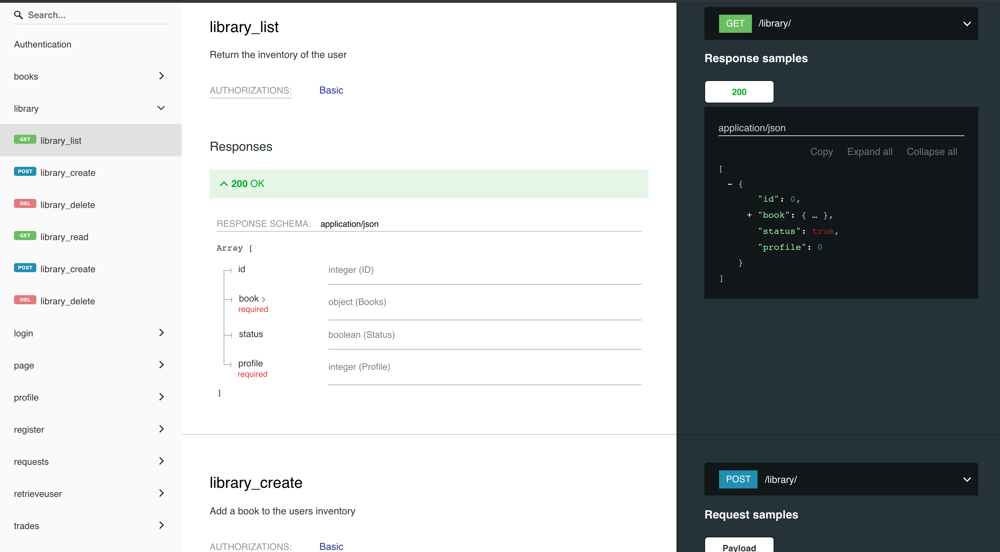

# Django/Python Rest API for Book Swap 

A swagger documented back end with custom endpoints that allow users to create, read, update, delete entries for their library/wishlist,trades etc. 




Built from the 4GeeksAcademy Django Python starter template here: [https://github.com/4GeeksAcademy/django-rest-hello](https://github.com/4GeeksAcademy/django-rest-hello)


# API Starter Template (Python & Django REST)

A django-rest boilerplate for 4Geeks Academy students. It features ready-for-deployment on heroku instructions.

## Features

- It uses the latest python version (as of Oct 2018).
- Ready to deploy to heroku in just 1 minute (for free).
- 100% compatible with [c9.io](http://c9.io) .

## How to install this project :question:

Follow these steps:

1. Make sure you have python 3.6 installed, if you are using Cloud9 you can install it by typing:
```sh
$ pyenv install 3.6.6   (this step takes a while)

$ pyenv global 3.6.6
```

2. Install [Django](https://www.djangoproject.com/) and [pipenv](https://pipenv.readthedocs.io/en/latest/) 
```sh
$ sudo pip install django pipenv
```

##### :warning: Only run these steps 3 & 4 if you are starting the project from scratch

3. Make sure your current folder is empty. 
```sh
$ ls
```
It should show no files or folders.

4. Create a new project using the 4Geeks Academy django-rest-hello template:
```sh
$ django-admin startproject <project_name> . --template=https://github.com/4GeeksAcademy/django-rest-hello/archive/master.zip --name=Procfile
```
Note: You can replace ``<project_name>`` with your desired project name.

##### :warning: All team members need to run these 5,6,7 steps.

5. Install any default packages (similar to `npm install` when using javascript) and get inside your recently created python envirnoment
```sh
$ pipenv install

$ pipenv shell
```

6. Run migrations
```sh
$ python manage.py migrate
```

7. Start the python server
```sh
$ python manage.py runserver $IP:$PORT
```

## What next?

Your python API should be running smoothly.


## Deploy your project to Heroku
If you don't have your code connected to a github repository, please do it:
```
$ git init
$ git add -A
$ git commit -m "Initial commit"
```
Then, run these 3 steps to deploy to heroku:
```sh
$ heroku create
$ git push heroku master

$ heroku run python manage.py migrate
```

### Aditional Tutorials
- [Working with django /admin](https://github.com/4GeeksAcademy/django-rest-hello/blob/master/docs/ADMIN.md) to create superusers, add models to your admin, etc.
- [Using the python shell](https://github.com/4GeeksAcademy/django-rest-hello/blob/master/docs/DATABASE_API.md) to CRUD models, etc.
- [Working with Migrations](https://github.com/4GeeksAcademy/django-rest-hello/blob/master/docs/MIGRATIONS.md) for everytime you change your model
- [Using MySQL](https://github.com/4GeeksAcademy/django-rest-hello/blob/master/docs/MYSQL.md) insalling and using MySQL in your application.
- [Using Mongo](https://github.com/4GeeksAcademy/django-rest-hello/blob/master/docs/MONGO.md) insalling and using mongo in your application.

## Packages Being Used (Documentation)
- [Django CORS Headers](https://github.com/ottoyiu/django-cors-headers)
- [Django REST Framework](https://github.com/encode/django-rest-framework)
